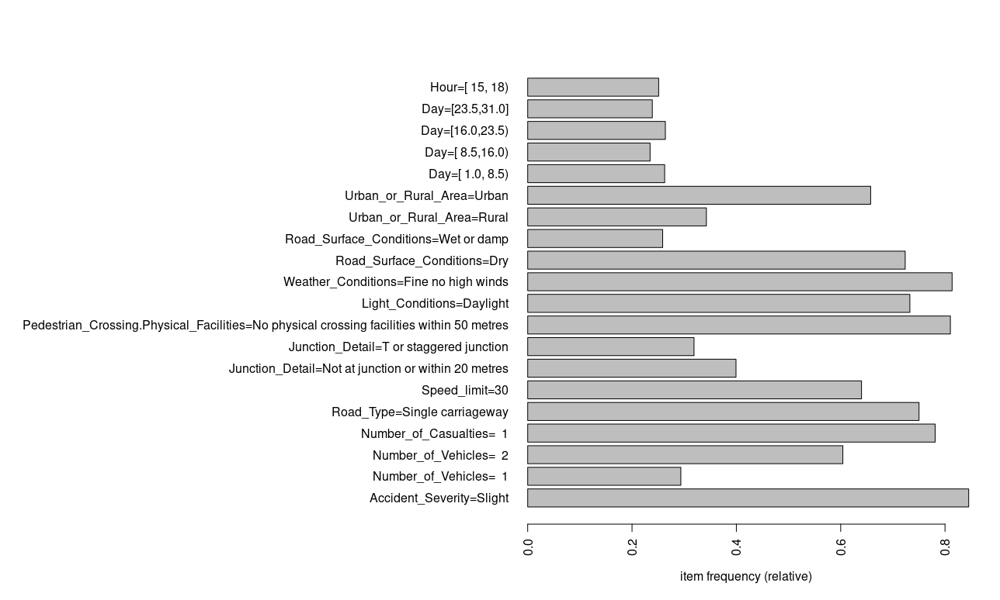

```{r setup, include=FALSE}
knitr::opts_chunk$set(echo = TRUE, warning = FALSE, message = FALSE)
library(readxl)
library(lubridate)
library(arules)		
library(arulesViz)

original.data <- read.csv(file="Accidents_2015.csv", header=TRUE)
```

## Data pre processing
After reading the data from the csv file, we decided that it would be more readable if we converted all the values in the data frame to their corresponding label in the xls file, so we decided to make it dynamically.
We loaded the xls file and made a function that receives the column name and the correspondent excel section name and it returns the nominal values instead of the numeric codes.

```{r}

# Reads information from excel guide, used to label the data
read_excel_allsheets <- function(filename) {
  sheets <- readxl::excel_sheets(filename)
  sheets <- sheets[3:length(sheets)]
  x <- lapply(sheets, function(X) readxl::read_excel(filename, sheet = X))
  names(x) <- sheets
  x
}


# Converts code values of col col_name to labels in excel_section_name
convert_codes <- function(df, col_name, excel_section_name) {
  df[[col_name]] <- sapply(df[[col_name]], function(i) if(!is.na(i)) subset(mysheets[[excel_section_name]], code == i)$label else NA)
  df
}

mysheets <- read_excel_allsheets("Road-Accident-Safety-Data-Guide.xls")
```


```{r, echo=FALSE}
data.discretized <- original.data
```

We decided to convert the date attribute into two separate columns (Day and Month), and to remove the minutes from the time, because we think it's not important to rule generation

```{r}
# Converts date and time content into separated columns
convert_date_and_time <- function(df) {
  df$Date <- as.Date(df$Date, "%d/%m/%Y")
  df$Day <- day(df$Date)               
  df$Month <- month(df$Date)
  df$Date <- NULL
  
  df$Time <- hm(df$Time)
  df$Hour <- hour(df$Time)
  df$Time <- NULL
  df
}
data.discretized <- convert_date_and_time(data.discretized)
```

In the excel it's explained that the missing values in the data is represented with -1 so we converted them to NA

```{r}
data.discretized[data.discretized==-1] <- NA
```

## Data discretization

To effectively generate rules the data needs to be discretized

* Number of Vehicles: 1, 2, 3, 5+
* Number of Casualties: 1, 2, 3, 5+
* Day: split in 4 intervals, representing the weeks of the month.
* Hour: Hours of the day will be split in intervals of 3 hours each, starting at midnight.


```{r, eval=FALSE}
# Discriteze all data 


# Longitude 
data.discretized$Longitude<- discretize(data.discretized$Longitude, method = "interval", categories = 10)
# Latitude
data.discretized$Latitude<- discretize(data.discretized$Latitude, method = "interval", categories = 10)
# Police Force
data.discretized <- convert_codes(data.discretized, "Police_Force", "Police Force")
data.discretized$Police_Force <- factor(data.discretized$Police_Force)
# Accident Severity
data.discretized <- convert_codes(data.discretized, "Accident_Severity", "Accident Severity")
data.discretized$Accident_Severity <- factor(data.discretized$Accident_Severity)
# Number of Vehicles
n_vehicles.range <- c(1,2,3,5,Inf)
data.discretized$Number_of_Vehicles <- discretize(data.discretized$Number_of_Vehicles, method = "fixed", categories = n_vehicles.range)
# Number of Casualties
n_casualties.range <- c(1,2,3,5,Inf)
data.discretized$Number_of_Casualties <- discretize(data.discretized$Number_of_Casualties, method = "fixed", categories = n_casualties.range)
# Day of Week
data.discretized <- convert_codes(data.discretized, "Day_of_Week", "Day of Week")
data.discretized$Day_of_Week <- factor(data.discretized$Day_of_Week)
# Road Type
data.discretized <- convert_codes(data.discretized, "Road_Type", "Road Type")
data.discretized$Road_Type <- factor(data.discretized$Road_Type)
# Speed Limit
data.discretized$Speed_limit <- factor(data.discretized$Speed_limit)
# Junction Detail
data.discretized <- convert_codes(data.discretized, "Junction_Detail", "Junction Detail")
data.discretized$Junction_Detail <- factor(data.discretized$Junction_Detail, exclude = NULL)
# Ped Cross - Physical
data.discretized <- convert_codes(data.discretized, "Pedestrian_Crossing.Physical_Facilities", "Ped Cross - Physical")
data.discretized$Pedestrian_Crossing.Physical_Facilities <- factor(data.discretized$Pedestrian_Crossing.Physical_Facilities)
# Light Conditions
data.discretized <- convert_codes(data.discretized, "Light_Conditions", "Light Conditions")
data.discretized$Light_Conditions <- factor(data.discretized$Light_Conditions)
# Weather Conditions
data.discretized <- convert_codes(data.discretized, "Weather_Conditions", "Weather")
data.discretized$Weather_Conditions <- factor(data.discretized$Weather_Conditions)
# Road Surface
data.discretized <- convert_codes(data.discretized, "Road_Surface_Conditions", "Road Surface")
data.discretized$Road_Surface_Conditions <- factor(data.discretized$Road_Surface_Conditions)
# Urban Rural
data.discretized <- convert_codes(data.discretized, "Urban_or_Rural_Area", "Urban Rural")
data.discretized$Urban_or_Rural_Area <- factor(data.discretized$Urban_or_Rural_Area)
# Day
data.discretized$Day <- discretize(data.discretized$Day, method="interval", categories=4)
# Month
data.discretized$Month <- factor(data.discretized$Month)
# Hour
hour.range <- c(3,6,9,12,15,18,21,Inf)
data.discretized$Hour <- discretize(data.discretized$Hour, method="fixed", categories=hour.range)

```

```{r, echo=FALSE}
# load data.discretized from RData file
load("./data.RData")
original.data.discretized <- data.discretized
```

After analising the data, we found some attributes that will be irrelevant to our task.
Those are:

* Accident Index: Each number is unique to each accident so it doesn't contribute to any meaningful rules.
* Location Easting OSRG, Location Northing OSGR, Longitude, Latitude, Local Authorities: all these attributes represent information about the local of the accident. We chose LSOA (Lower Layer Super Output Area) as the attribute representative of space. This will also help to group accidents in the same area together.
* Carriageway Hazards, Pedestrian Crossing (Human Control), Special Conditions at Site: We noticed all these attributes had one class with >97% of frequency, so we decided to remove them from the data because there isn't frequent itemsets with classes different from the most frequent, if we consider a support bigger than 0.03% which we think is low.
* Did Police Officer Attend Scene of Accident: We think is irrelevant to the problem.
* Juncion Control: 40% of the data is missing

```{r, echo=FALSE}
# Ignore useless variables.
useless <- c("Accident_Index", "Location_Easting_OSGR", "Location_Northing_OSGR", "Latitude", "Longitude", "LSOA_of_Accident_Location", "Local_Authority_.District.", "Local_Authority_.Highway.", "Carriageway_Hazards", "Pedestrian_Crossing.Human_Control", "Special_Conditions_at_Site", "Did_Police_Officer_Attend_Scene_of_Accident","X2nd_Road_Number", "X2nd_Road_Class", "X1st_Road_Class", "X1st_Road_Number", "Junction_Control")
data.discretized <- original.data.discretized[, !names(original.data.discretized) %in% useless]
```

## Data Analysis

#### Frequent Items
```{R, eval = FALSE}
itemFrequencyPlot(as(data.discretized, "transactions"), support = 0.2, horiz = TRUE)
```




We can see that most accidents happen between 15h and 18h, and that the number of accidents is well distributed in each quarter of the month. There's more accidents in a urban area than in a rural, but they are both frequent. It's also frequent to have accidents in a dry or a wet condition but there's more in a dry condition. The weather is mostly fine without high winds, and during the daylight. Most accidents happen in a 60 speed limit zone. It's frequent that the accidents happen between 1 or 2 cars, but mostly there is only one casualty. Over 80% of the accidents were considered slight.

#### Maximally Frequent Itemsets

```{R, results = "hide"}
max.frequent.sets <- apriori(data.discretized, parameter = list(target = "maximally frequent itemsets", support = 0.55), control = list(sort = -1))
```
```{R}
inspect(max.frequent.sets)
```

Calculating the maximally frequent itemsets, using a support of 55%, we can see that 60% of the accidents have 2 vehicles involved but there's no other frequent itemset with 2 number of vehicles (with support of 55%). 
We can also see that there are many frequent sets with slight accident severity but none of those sets form a frequent superset.


#### Lift
```{R, results = "hide"}
rules <- subset(apriori(data.discretized, parameter = list(maxtime = 5, support = 0.1)), lift > 2.5)
```


```{R}
inspect(rules)
```

Selecting the rules with an high lift value (>2.5) we got this rules which tells us that the items in each rule are highly dependent. We can see that road being wet or damp is highly dependendant that it's raining, which agrees with our assumptions.
We also can see that being in a rural area depends if the speed limit of the road is 60, the road is single carriageway and that there is no physical crossing facilities within 50 meters.


```{R, results = "hide"}
rules <- apriori(data.discretized, param = list(support = 0.1))
```
```{R}
plot(rules)
```


As an attempt to retrieve meaningful attributes that accour in serious accidents, the aditional time and space data was removed (Day of week, day, month, hour, police force). The rule lenght was also limited to 2.
```{r, echo=FALSE}
useless <- c("Accident_Index", "Location_Easting_OSGR", "Location_Northing_OSGR", "Latitude", "Longitude", "LSOA_of_Accident_Location", "Local_Authority_.District.", "Local_Authority_.Highway.", "Carriageway_Hazards", "Pedestrian_Crossing.Human_Control", "Special_Conditions_at_Site", "Did_Police_Officer_Attend_Scene_of_Accident","X2nd_Road_Number", "X2nd_Road_Class", "X1st_Road_Class", "X1st_Road_Number", "Junction_Control", "Day_of_Week", "Day", "Month", "Hour", "Police_Force")
data.discretized <- original.data.discretized[, !names(original.data.discretized) %in% useless]
```
```{R, results = "hide"}
rules <- subset(apriori(data.discretized, param = list(minlen = 1, support = 0.001, confidence = 0.1, maxlen=2)), subset = rhs %in% "Accident_Severity=Serious" & lift > 1)
```
```{R}
inspect(sort(rules, by="lift"))
```

We can see that a bigger number of casualities is correlated with serious accidents. This relationship makes sense and is expected, as accidents envolving a lot of casualties need a serious motive to happen.


